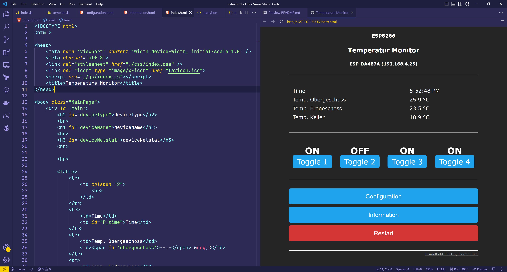

# ESP8266/ESP32 Project

I have started this project to learn more about programming ESP/Arduino micro controller. This helped me to get more into C++ and Javascript. This is only the web part of my project and is currently under development, so this only works partially (Switching buttons on/off only works on the ESP directly, not in this project). The full version for ESP8266/ESP32 is currently private.

